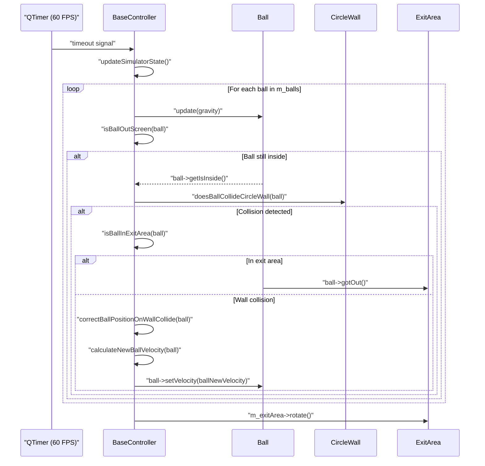

## Table of Contents

1. [Preview](#preview)
2. [Project Overview](#project-overview)  
3. [Current State](#current-state)  
4. [Architecture & Design](#architecture--design)  
5. [Technologies & Tools](#technologies--tools)
6. [UML sequence diagram ](#uml-sequence-diagram)
7. [UML class diagram](#uml-class-diagram)
8. [Download & Release](#download--release)
 
---

### Preview

---

## Project Overview

The **Bouncing Balls Simulator** is a modular desktop application written in C++ using the Qt6 framework. It implements a physics-based simulation where multiple balls bounce within predefined environments. The simulation leverages vector algebra for calculating coordinates and physics interactions, including gravity, collision detection, and collision response. This project showcases expertise in software architecture, object-oriented design, and Qt graphics programming.

Key features:
- Real-time physics simulation at 60 FPS  
- Dynamic spawning and removal of balls  
- Collision handling with circular boundaries and custom obstacles  
- Rotating exit portal that recycles balls  

---

## Current State

The simulator features a single environment in which multiple balls bounce within a circular boundary. Balls are spawned continuously, fall under gravity, collide with the circular wall, and eventually exit through a rotating portal. Each time a ball departs, several new balls are generated to maintain a constant population.

---

## Architecture & Design

The simulator follows a clean **Model-View-Controller (MVC)** pattern to ensure maintainability and extensibility. Each component adheres to SOLID principles, with a clear separation of concerns.

- **Main** (`main.cpp`)  
  - Initializes application and Qt event loop  
  - Instantiates controller, model, and view components  

- **Controller** (`BaseController`)  
  - Manages the simulation timer  
  - Invokes physics updates and collision checks each tick 
  - Signals view to render the updated state  

- **Model**  
  - `Ball`: Properties include position, velocity, mass, and radius  
  - `CircleWall`: Defines circular boundary for collisions  
  - `ExitArea`: Represents a rotating triangular portal for ball exit  

- **View** (`BaseView`)  
  - Renders simulation objects using Qt6 Graphics Framework  
  - Maintains smooth animations at 60 FPS  

---

## Technologies & Tools

- **Language:** C++17
- **Framework:** Qt6
- **Build System:** CMake 3.19
- **Version Control:** Git
- **IDE:** Visual Studio Code

---

## UML sequence diagram
Below is a UML sequence diagram illustrating how the main loop operates:

---

## UML class diagram
Below is a UML class diagram illustrating the project’s MVC-pattern structure:

## Download & Release

Download the latest prebuilt Windows release (v1.0.0) here:
[https://github.com/binhpham199x/bouncing-balls-simulator/releases/tag/v1.0.0](https://github.com/binhpham199x/bouncing-balls-simulator/releases/tag/v1.0.0)
