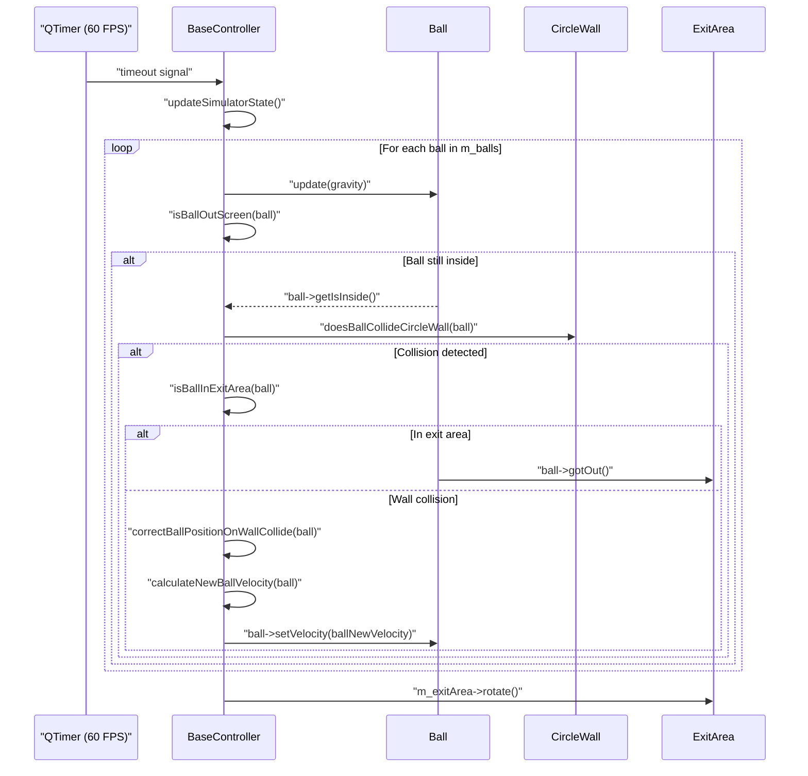

```mermaid
sequenceDiagram
    participant QTimer as "QTimer (60 FPS)"
    participant BaseController
    participant Ball
    participant CircleWall
    participant ExitArea

    QTimer->>BaseController: "timeout signal"
    BaseController->>BaseController: "updateSimulatorState()"

    loop For each ball in m_balls
        BaseController->>Ball: "update(gravity)"
        BaseController->>BaseController: "isBallOutScreen(ball)"

        alt Ball still inside
            Ball-->>BaseController: "ball->getIsInside()"
            BaseController->>CircleWall: "doesBallCollideCircleWall(ball)"

            alt Collision detected
                BaseController->>BaseController: "isBallInExitArea(ball)"

                alt In exit area
                    Ball->>ExitArea: "ball->gotOut()"
                else Wall collision
                    BaseController->>BaseController: "correctBallPositionOnWallCollide(ball)"
                    BaseController->>BaseController: "calculateNewBallVelocity(ball)"
                    BaseController->>Ball: "ball->setVelocity(ballNewVelocity)"
                end
            end
        end
    end

    BaseController->>ExitArea: "m_exitArea->rotate()"
```